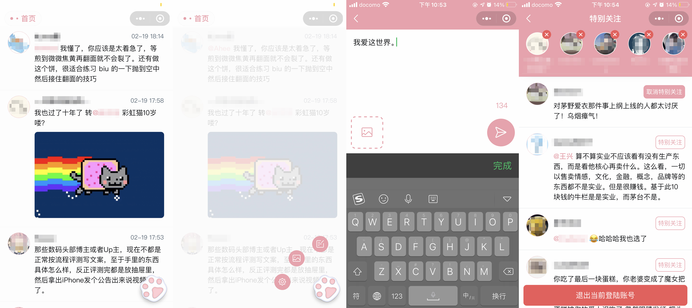

# XiaoFanQuan
小饭圈是一个饭否微信小程序客户端，主要功能是特别关注，允许对最多五个饭友设置特别关注。

饭否本就是个小圈子，但和有些饭友的圈更小。因为没有取关的习惯，导致关注的人越来越多，为了不漏掉最最关注的消息，所以开发了这个微信小程序客户端。

因为微信小程序审核的政策限制，未通过审核，本仓库做归档用。

## 安装和使用
替换 config/app.js 和 project.config.json 两个文件里的配置为自己的配置，然后导入小程序官方开发工具。

## 功能展示

